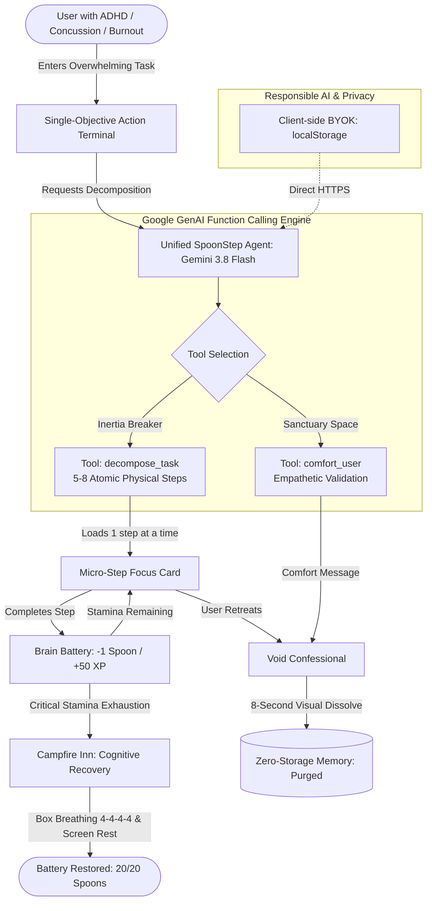

# 🥄 SpoonStep
> **Gamified Cognitive Scaffold & Energy Pacing AI for ADHD, Burnout, and Concussion Recovery.**

[](https://hack-for-humanity-summer-26.devpost.com/)
[](https://aistudio.google.com/)
[](#)
[](#)
[](https://aistudio.google.com/)
[](https://spoon-step.onrender.com/)

---

## 💡 The Problem
* **Executive Dysfunction & ADHD Paralysis**: Staring at a long to-do list triggers cognitive freeze, overwhelm, and shame spirals.
* **Concussion & Brain Injury (TBI) Recovery**: Patients experience severe cognitive fatigue. Pushing through exhaustion triggers symptom relapses. International concussion guidelines mandate strict **cognitive pacing and energy conservation**.
* **Toxic Productivity Apps**: Traditional task managers demand relentless streaks, guilt-tripping users when their nervous system is depleted.

---

## 🎯 The Solution: SpoonStep
**SpoonStep** translates neuroscience and **Christine Miserandino's Spoon Theory** into a gentle, retro-RPG micro-tasking interface powered by **Google Gemini**.

Instead of a long, terrifying to-do list, SpoonStep gives you **strictly ONE physical movement at a time**, tracks your finite cognitive stamina, and forcibly retreats you to a safe zone before a mental crash.

---

## ✨ Key Features & Clinical Grounding

### 1. ⚔️ Single Micro-Movement Terminal (Cognitive Load Theory)
* Powered by Gemini Function Calling (`gemini-3.8-flash`), overwhelming tasks (e.g., *"Clean chaotic apartment"*) are decomposed into **5–8 atomic physical movements** (*"Stand up and look at the sink for 5 seconds"*, *"Rinse one single fork"*).
* Eliminates decision paralysis by hiding all future steps.

### 2. 🥄 Brain Battery & Pacing (20 Spoons Stamina)
* Based on clinical Spoon Theory: each user starts with 20 Spoons (100% HP).
* Each micro-step costs **1 Spoon (-5% HP)** and rewards **+50 XP** with satisfying floating combo particles.

### 3. 🛡️ Campfire Inn (Concussion Recovery & Screen Break)
* When stamina drops below **15%**, the app disables all task inputs and triggers mandatory cognitive rest.
* Built-in **Box Breathing (4-4-4-4)** animated visual pacer activates the parasympathetic nervous system.
* Enforces a 20-minute screen break to prevent post-concussion symptom flare-ups.

### 4. 🌌 Void Sanctuary & Zero-Storage Ephemeral Memory (Responsible AI)
* When overwhelmed, users can vent their raw feelings to a safe zone.
* The unified Gemini agent invokes the `comfort_user` tool to deliver pressure-free emotional validation (zero toxic positivity).
* **Privacy-First (Data Minimization)**: The vent text blurs and **dissolves into the void after 8 seconds**. Zero database persistence, zero tracking, completely ephemeral.

### 5. 🔑 Judge-Friendly BYOK (Bring Your Own Key)
* Built-in API Key Modal allows hackathon judges and users to securely test with their own Google AI Studio key stored locally in `localStorage`.

---

## 🛠️ Tech Stack & Architecture
* **AI Prototyping & Development**: Google AI Studio & Google Antigravity IDE
* **AI Engine & Function Calling**: Google Gemini (`gemini-3.8-flash`) via Google GenAI SDK (`@google/genai`)
* **Hosting & CI/CD**: Render (1-click Blueprint with `render.yaml`)
* **Frontend**: React 19, TypeScript, Vite, Tailwind CSS
* **Animations & Micro-interactions**: Framer Motion (`motion/react`)
* **Audio Synthesis**: Native Web Audio API (custom 8-bit chiptune sound generator, zero external audio assets)
* **Icons**: Lucide React

### 🏛️ System Architecture Workflow



---

## 🔒 Responsible AI & Safety Guardrails
1. **Privacy & Ephemeral Memory**: No sensitive user thoughts or mental health notes are stored on servers or logged.
2. **Explicit Medical Disclaimer**: SpoonStep is a cognitive pacing scaffold, not a replacement for clinical psychiatric or neurological care.
3. **Zero Medical Hallucination**: Tool definitions restrict the model strictly to physical movement decomposition and empathetic listening.

---

## 🚀 Quick Start for Judges

[](https://render.com/deploy)

### 1. Clone & Install
```bash
git clone https://github.com/your-username/spoon-step.git
cd spoon-step
npm install
```

### 2. Run Locally
```bash
npm run dev
```
Open `http://localhost:5173` in your browser.

### 3. Connect API Key (In-App BYOK)
Click the **🔑 API Key** button in the header (or simply start any micro-quest) and enter your free key from [Google AI Studio](https://aistudio.google.com/apikey). The key is stored securely in your browser's local storage—no `.env` file configuration required.

---

## 📋 Hackathon Submission Alignment

| Category | How SpoonStep Addresses It |
| :--- | :--- |
| **Mental Health** | Dismantles executive paralysis, shame spirals, and ADHD inertia into non-threatening atomic steps. |
| **Concussion Recovery** | Enforces cognitive pacing, finite spoon budget, box breathing, and mandatory screen-break rest. |
| **Responsible AI** | 8-second ephemeral memory dissolution, BYOK architecture, zero third-party health tracking. |
| **UI/UX & Accessibility** | High-contrast dark theme, low visual clutter, large legible typography, and playful retro-RPG delight. |

---

## 📄 License
This project is open-source and available under the [MIT License](LICENSE).  
Copyright © 2026 Veronika Kashtanova.

---

### ⚖️ Disclaimer
*SpoonStep is a supportive cognitive pacing game inspired by Spoon Theory and neuroscience. It is not intended to diagnose, treat, or replace professional medical, psychiatric, or neurological consultation.*
